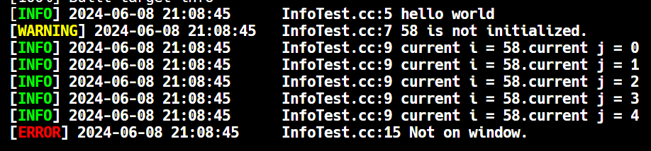

# micro log system toy.

## preview


``` plain text
-------------------------------------------------------------------------------
Language                     files          blank        comment           code
-------------------------------------------------------------------------------
C++                              3             17              0             73
C/C++ Header                     2             18              5             49
CMake                            3              4              0             14
Markdown                         1              0              0              1
-------------------------------------------------------------------------------
SUM:                             9             39              5            137
-------------------------------------------------------------------------------
```
## prerequest
cxx compiler support cpp standard >= 17

## usage
see sample/InfoTest.cc

